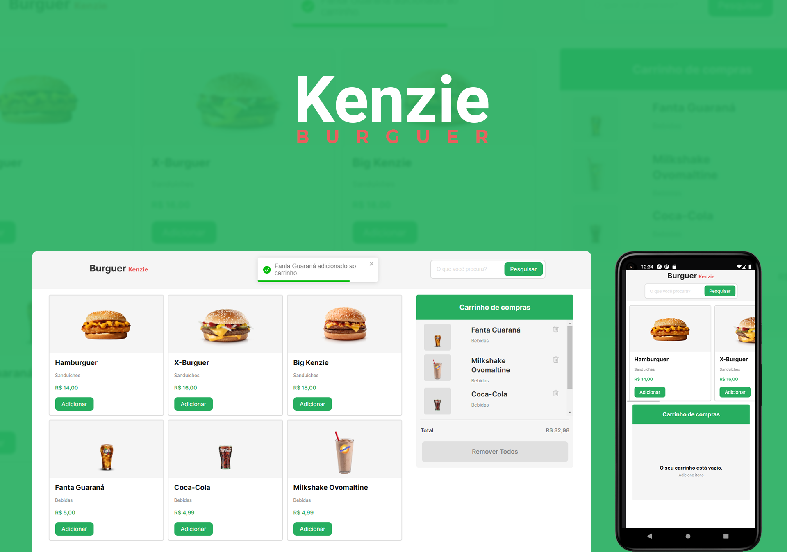

<h1 align="center">
  
</h1>
<br>
<p align="center">
  <a href="#-projeto">Projeto</a>&nbsp;&nbsp;&nbsp;|&nbsp;&nbsp;&nbsp;
  <a href="#-tecnologias">Tecnologias</a>&nbsp;&nbsp;&nbsp;|&nbsp;&nbsp;&nbsp;
  <a href="#-features">Features</a>&nbsp;&nbsp;&nbsp;|&nbsp;&nbsp;&nbsp;
  <a href="#-layout">Layout</a>&nbsp;&nbsp;&nbsp;|&nbsp;&nbsp;&nbsp;
  <a href="#-executando-o-projeto">Executando o projeto</a>&nbsp;&nbsp;&nbsp;|&nbsp;&nbsp;&nbsp;
  <a href="#memo-licença">Licença</a>
</p>

<br>


<p align="center">
  
  
  
  
</p>

<p align="center">
  <a href="https://kenzie-burguer-navy.vercel.app/">Clique aqui</a> para acessar a versão web
</p>

## ✨ Projeto

Kenzie Burguer é um e-commerce desenvolvido para o ramo de delivery, o cliente pode adicionar itens ao carrinho e também efetuar pesquisas por nome de categoria ou produto. O projeto é 100% responsivo para telas com até 4k de resolução.

## 🚀 Tecnologias

Esse projeto foi desenvolvido com as seguintes tecnologias/bibliotecas:

<table border="0">
 <tr>
<td> HTML5</td>
<td> CSS3</td>
<td> JavaScript</td>
<td> React.JS</td>
<td> Styled Components</td>
<td> React Toastify</td>
<td> API Rest</td>
 </tr>
</table>

## 🌟 Features

-   [ ] Adição e Remoção de produtos no carrinho.
-   [ ] 100% responsivo em resoluções até 4k.
-   [ ] Filtro de pesquisa por categorias ou nome de produto.
-   [ ] Carrinho com valor total e possibilidade de remoção de todos produtos.
-   [ ] Notificações dinâmicas em diversas ações do site.

## 🎨 Layout

Você pode visualizar o layout do projeto através [desse link](https://www.figma.com/file/Nx4WZEFXnHzeFsxRaw8y18/M3---1B07---Entrega---Hamburgueria-da-Kenzie?node-id=0%3A1). É necessário ter conta no [Figma](https://figma.com) para acessá-lo.

## 👨🏻‍💻 Executando o projeto

Utilize o **yarn** ou o **npm install** para instalar as dependências do projeto.
Em seguida, inicie o projeto.

Iniciando a versão web:

```cl
yarn start ou npm run dev
```

## :memo: Licença

Esse projeto está sob a licença MIT. Veja o arquivo [LICENSE](./LICENSE.md) para mais detalhes.

---
